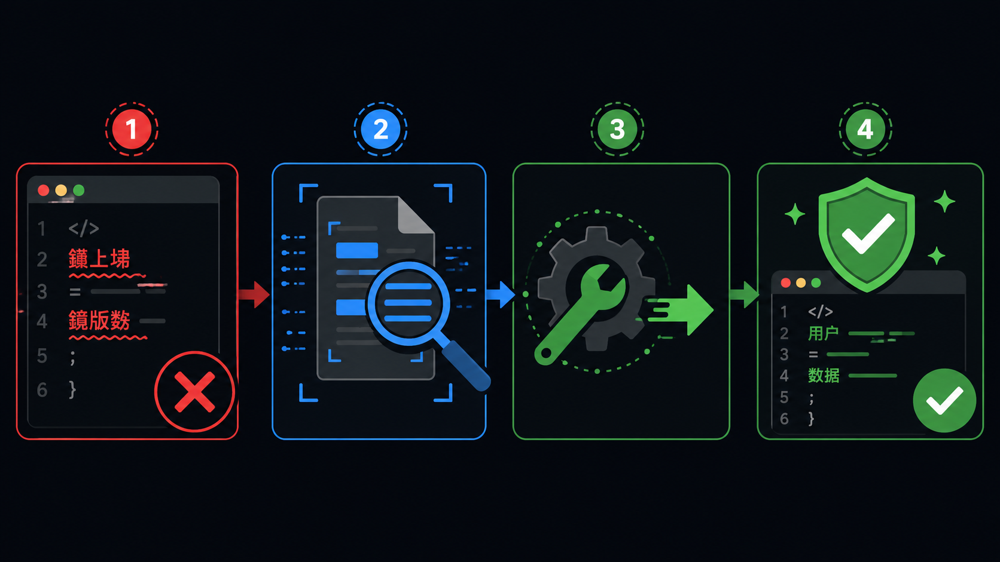

# AI Text Encoding Guard

<p align="center">
  
</p>

<p align="center">
  <a href="https://github.com/haodehaode378/text-encoding-guard/actions/workflows/ci.yml"></a>
  <a href="LICENSE"></a>
  
  
</p>

<p align="center">
  <a href="#中文">中文</a> &nbsp;|&nbsp; <a href="#english">English</a>
</p>

---

# 中文

**AI 编码助手把中文搞成乱码了？自动检测，一键修复。**

<p align="center">
  
</p>

## 问题是什么

当 AI 编码助手（Claude、Cursor、Copilot、Codex）编辑含中文的文件时，编码损坏会悄然发生。UTF-8 字节被误读为 GBK — 等你发现时用户已经看到乱码了。

```
 修复前（乱码）                  修复后（正常）
 ─────────────────────           ─────────────────────
 // 鐢ㄦ埛鐧诲綍鎴愬姛             // 用户登录成功
 // 鏁版嵁搴撹繛鎺ュけ璐�           // 数据库连接失败
 // 璁㈠崟鍒涘缓鎴愬姛              // 订单创建成功
```

HTML 标签损坏也能捕获：

```html
<!-- AI 编辑后 → 标签损坏 -->
<p>鐢ㄦ埛涓�績</p>
?/div>              <!-- ← </div> 的 < 被吃掉了 -->

<!-- 修复后 → 完整恢复 -->
<p>用户中心</p>
</div>
```

### 谁会中招？

| 场景 | 中招概率 | 后果 |
|:-----|:--------:|:-----|
| Claude Code 编辑含中文的 Vue/React 组件 | **极高** | UI 文案全变乱码，用户直接看到 |
| Cursor 批量重构中文注释 | **高** | 代码可读性归零，新人看不懂 |
| Copilot 生成中文文档 | **中** | README / CHANGELOG 变天书 |
| CI/CD 自动化脚本处理中文文件 | **中** | 静默损坏，上线后才发现 |

## 安装

```bash
git clone https://github.com/haodehaode378/text-encoding-guard.git
cd text-encoding-guard
pip install -e .
```

## 快速开始

```bash
# 扫描项目
check-mojibake --root ./src

# 自动修复（创建 .bak 备份）
check-mojibake --root ./src --fix-gbk

# JSON 输出
check-mojibake --root ./src --json

# CI 卡点：有乱码就失败
check-mojibake --root . --fail-on-find
```

<details>
<summary>不安装直接用</summary>

```bash
python scripts/check_mojibake.py --root ./src
# 或
python -m check_mojibake --root ./src
```

</details>

## 工作原理

### 七大检测维度

| 乱码类型 | 产生原因 | 检测信号 | 权重 |
|:---------|:---------|:---------|:----:|
| **口字码** | UTF-8 读 GBK | Unicode 替换字符 `�` | `+12` |
| **破标签** | AI 编辑吞尖括号 | 损坏的 HTML 闭合标签 | `+10` |
| **古文码** | GBK 读 UTF-8 | 18 个已知乱码码点 | `+2` |
| **锟拷码** | UTF-8→GBK→UTF-8 双重转换 | `锟斤拷` 模式匹配 | `+8` |
| **烫屯码** | VC 调试未初始化内存 | `烫烫烫` / `屯屯屯` 重复 | `+6` |
| **问句码** | 双重转换 | 中文后连续 `??` | `+8` |
| **符号码** | ISO8859-1 读 UTF-8 | 拉丁扩展字符密集出现 | `+2` |

> 文件总分 > 0 即标记为可疑。分数越高，乱码越严重。

### 修复机制

`--fix-gbk` 不是盲目替换，遵循**三重安全门**：

```
 ① 尝试 GB18030 编码 → UTF-8 解码（逆向还原）
    也尝试反方向：UTF-8 编码 → GB18030 解码
         ↓
 ② 修复后分数必须 ≤ 原分数的 1/3
         ↓
 ③ 绝对改善值必须 ≥ 8 分
         ↓
   ┌─ 全部通过 → 写入修复 + 创建 .bak.mojibake 备份
   └─ 任一失败 → 跳过，标记为需人工检查
```

## 集成方式

### GitHub Actions — 一行搞定

```yaml
name: Encoding Guard
on: [push, pull_request]
jobs:
  check:
    runs-on: ubuntu-latest
    steps:
      - uses: actions/checkout@v4
      - uses: haodehaode378/text-encoding-guard@v1
```

PR 有乱码自动拦截。

<details>
<summary>可选参数</summary>

```yaml
- uses: haodehaode378/text-encoding-guard@v1
  with:
    root: './src'              # 扫描目录（默认 .）
    fix-gbk: 'true'            # 自动修复（默认 false）
    ext: '.sql,.cfg'           # 额外扩展名
```

</details>

### Claude Code — 每次编辑自动触发

**第一步** — 添加 PostToolUse hook：

```json
{
  "hooks": {
    "PostToolUse": [
      {
        "matcher": "Write|Edit",
        "command": "python scripts/check_mojibake.py --root .",
        "description": "Check for Chinese mojibake after file edits"
      }
    ]
  }
}
```

**第二步**（可选）— 安装 skill：

```bash
cp -r .claude/skills/text-encoding-guard/ /path/to/your/project/.claude/skills/
```

## CLI 参考

| 参数 | 说明 | 示例 |
|:-----|:-----|:-----|
| `--root PATH` | 要扫描的根目录（必填） | `--root ./src` |
| `--json` | JSON 格式输出 | `--json` |
| `--fail-on-find` | 发现可疑文件时退出码 2 | `--fail-on-find` |
| `--fix-gbk` | 尝试自动 GBK→UTF-8 修复 | `--fix-gbk` |
| `--ext` | 添加额外扩展名（可多次） | `--ext .sql --ext .cfg` |
| `--verbose` | 显示详细诊断信息 | `-v` |
| `--quiet` | 静默模式 | `-q` |

### 扫描范围

**默认 20 种扩展名：**
`.py` `.md` `.txt` `.json` `.yaml` `.yml` `.toml` `.ini` `.js` `.ts` `.tsx` `.jsx` `.vue` `.html` `.css` `.scss` `.sh` `.bat` `.ps1` `.xml`

**自动跳过：**
`.git` `node_modules` `dist` `build` `__pycache__` `.venv` `venv` `target` `.idea` `.vscode` `.claude`

## 为什么用这个工具？

| 对比项 | 本工具 | 手动检查 | file/uchardet |
|:-------|:------:|:--------:|:-------------:|
| 精确检测乱码 | :white_check_mark: 评分制 | :x: 肉眼看 | :x: 只检测编码 |
| 自动修复 | :white_check_mark: 保守+备份 | :x: | :x: |
| CI 集成 | :white_check_mark: 退出码 2 | :x: | :x: |
| AI 助手触发 | :white_check_mark: hooks | :x: | :x: |
| 零依赖 | :white_check_mark: 纯 stdlib | N/A | 需要安装 |
| 双向修复 | :white_check_mark: UTF-8↔GBK | :x: | :x: |

## 开发

```bash
# 安装开发依赖
pip install -e ".[test]"

# 运行测试
pytest

# 运行测试（含覆盖率）
pytest --cov=src/check_mojibake --cov-report=term-missing
```

## 许可证

[MIT](LICENSE)

---

<a id="english"></a>

# English

**AI agents corrupting your Chinese text? Detect it, fix it, ship it.**

<p align="center">
  
</p>

## The Problem

When AI coding assistants (Claude, Cursor, Copilot, Codex) edit files with Chinese text, encoding corruption silently creeps in. UTF-8 bytes get misread as GBK — and you don't notice until users see garbage.

```
 Before (corrupted)              After (recovered)
 ─────────────────────           ─────────────────────
 // 鐢ㄦ埛鐧诲綍鎴愬姛             // 用户登录成功
 // 鏁版嵁搴撹繛鎺ュけ璐�           // 数据库连接失败
 // 璁㈠崟鍒涘缓鎴愬姛              // 订单创建成功
```

Broken HTML tags are also caught:

```html
<!-- After AI edit — broken tags -->
<p>鐢ㄦ埛涓�績</p>
?/div>              <!-- ← </div> lost its < -->

<!-- After fix — fully recovered -->
<p>用户中心</p>
</div>
```

### Who Gets Hit?

| Scenario | Risk | Impact |
|:---------|:----:|:-------|
| Claude Code editing Vue/React with Chinese | **Very High** | UI text becomes garbled, users see it |
| Cursor batch-refactoring Chinese comments | **High** | Code readability drops to zero |
| Copilot generating Chinese docs | **Medium** | README / CHANGELOG become unreadable |
| CI/CD scripts processing Chinese files | **Medium** | Silent corruption, discovered after deploy |

## Installation

```bash
git clone https://github.com/haodehaode378/text-encoding-guard.git
cd text-encoding-guard
pip install -e .
```

## Quick Start

```bash
# Scan a project
check-mojibake --root ./src

# Auto-fix (creates .bak backup)
check-mojibake --root ./src --fix-gbk

# JSON output
check-mojibake --root ./src --json

# CI gate: fail on findings
check-mojibake --root . --fail-on-find
```

<details>
<summary>Run without installation</summary>

```bash
python scripts/check_mojibake.py --root ./src
# or
python -m check_mojibake --root ./src
```

</details>

## How It Works

### 7 Detection Types

| Type | Cause | Signal | Weight |
|:-----|:------|:-------|:------:|
| **Box chars** | UTF-8 read as GBK | Unicode replacement char `�` | `+12` |
| **Broken tags** | AI swallows angle brackets | Corrupted HTML closing tags | `+10` |
| **Ancient text** | GBK read as UTF-8 | 18 known mojibake codepoints | `+2` |
| **Kun-Kao** | UTF-8→GBK→UTF-8 double conversion | `锟斤拷` pattern match | `+8` |
| **Tang-Tun** | VC debug uninitialized memory | `烫烫烫` / `屯屯屯` repeats | `+6` |
| **Question code** | Double conversion | Consecutive `??` after Chinese | `+8` |
| **Symbol code** | ISO8859-1 read as UTF-8 | Dense Latin Extended characters | `+2` |

> Any file with score > 0 is flagged. Higher score = worse corruption.

### Fix Mechanism

`--fix-gbk` is not a blind replace — it follows a **triple safety gate**:

```
 ① Try GB18030 encode → UTF-8 decode (reverse recovery)
    Also try the other direction: UTF-8 encode → GB18030 decode
         ↓
 ② Fixed score must be ≤ 1/3 of original score
         ↓
 ③ Absolute improvement must be ≥ 8 points
         ↓
   ┌─ All pass → Write fix + create .bak.mojibake backup
   └─ Any fail → Skip, mark for manual review
```

## Integration

### GitHub Actions — One Line

```yaml
name: Encoding Guard
on: [push, pull_request]
jobs:
  check:
    runs-on: ubuntu-latest
    steps:
      - uses: actions/checkout@v4
      - uses: haodehaode378/text-encoding-guard@v1
```

PRs with mojibake get blocked automatically.

<details>
<summary>Optional parameters</summary>

```yaml
- uses: haodehaode378/text-encoding-guard@v1
  with:
    root: './src'              # Scan directory (default .)
    fix-gbk: 'true'            # Auto-fix (default false)
    ext: '.sql,.cfg'           # Extra extensions
```

</details>

### Claude Code — Auto-run on Every Edit

**Step 1** — Add a PostToolUse hook:

```json
{
  "hooks": {
    "PostToolUse": [
      {
        "matcher": "Write|Edit",
        "command": "python scripts/check_mojibake.py --root .",
        "description": "Check for Chinese mojibake after file edits"
      }
    ]
  }
}
```

**Step 2** (optional) — Install the skill:

```bash
cp -r .claude/skills/text-encoding-guard/ /path/to/your/project/.claude/skills/
```

## CLI Reference

| Flag | Description | Example |
|:-----|:------------|:--------|
| `--root PATH` | Root directory to scan (required) | `--root ./src` |
| `--json` | JSON output | `--json` |
| `--fail-on-find` | Exit code 2 when suspicious files found | `--fail-on-find` |
| `--fix-gbk` | Attempt auto GBK→UTF-8 fix | `--fix-gbk` |
| `--ext` | Add extra extensions (repeatable) | `--ext .sql --ext .cfg` |
| `--verbose` | Show detailed diagnostics | `-v` |
| `--quiet` | Suppress output | `-q` |

### Scan Scope

**Default 20 extensions:**
`.py` `.md` `.txt` `.json` `.yaml` `.yml` `.toml` `.ini` `.js` `.ts` `.tsx` `.jsx` `.vue` `.html` `.css` `.scss` `.sh` `.bat` `.ps1` `.xml`

**Auto-skipped:**
`.git` `node_modules` `dist` `build` `__pycache__` `.venv` `venv` `target` `.idea` `.vscode` `.claude`

## Why This Tool?

| Feature | This Tool | Manual Check | file/uchardet |
|:--------|:---------:|:------------:|:-------------:|
| Precise mojibake detection | :white_check_mark: Scoring | :x: Eyeball | :x: Encoding only |
| Auto-fix | :white_check_mark: Conservative + backup | :x: | :x: |
| CI integration | :white_check_mark: Exit code 2 | :x: | :x: |
| AI assistant trigger | :white_check_mark: Hooks | :x: | :x: |
| Zero dependencies | :white_check_mark: Pure stdlib | N/A | Requires install |
| Bidirectional fix | :white_check_mark: UTF-8↔GBK | :x: | :x: |

## Development

```bash
# Install dev dependencies
pip install -e ".[test]"

# Run tests
pytest

# Run tests with coverage
pytest --cov=src/check_mojibake --cov-report=term-missing
```

## License

[MIT](LICENSE)
